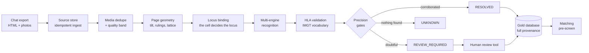

<div align="center">

# paper-to-allele

**Reading HLA lab reports from phone photos, and knowing when not to.**

[](https://github.com/mahmoudimahyar/paper-to-allele/actions/workflows/ci.yml)
[](LICENSE)
[](.python-version)
[](https://github.com/astral-sh/uv)
[](https://github.com/astral-sh/ruff)
[](pyproject.toml)

</div>

A document-understanding pipeline that turns photographs of tissue-typing lab
reports into validated, provenance-tracked HLA typings, and a deterministic
pre-screening engine that ranks kidney donor and recipient compatibility from
them.

The interesting part is not the OCR. It is everything around it: a wrong allele
or a wrong blood group is a clinical hazard, so the system is built to **abstain
rather than guess**, to **measure rather than assume**, and to keep every value
traceable to the pixels it came from.

> **Research prototype, not a medical device.** Nothing here replaces a
> transplant centre, antibody testing or a physical crossmatch. See
> [Safety, privacy and ethics](#safety-privacy-and-ethics).

---

## Contents

- [The problem](#the-problem)
- [Results so far](#results-so-far)
- [How it works](#how-it-works)
- [Design principles](#design-principles)
- [The matching pre-screen](#the-matching-pre-screen)
- [Engineering practices](#engineering-practices)
- [Three bugs worth telling](#three-bugs-worth-telling)
- [Quickstart](#quickstart)
- [Repository map](#repository-map)
- [Status and roadmap](#status-and-roadmap)
- [Safety, privacy and ethics](#safety-privacy-and-ethics)

---

## The problem

The source material is an archive of roughly 23,500 phone photographs of HLA
typing reports, shared over a messaging app together with 180,000 chat messages.
The photos are tilted, creased, recompressed, and sometimes survive only as
thumbnails. The forms mix Persian and Latin script, come from several laboratory
templates, and print two alleles per locus in cells a few millimetres wide.

Off-the-shelf OCR reads the characters well enough. What it cannot do is say
*which locus a number belongs to*, *whether a second allele was printed or merely
not read*, or *when it should refuse to answer*. In this domain those are the
questions that matter: reading `DRB1*04` into the `DQB1` row is not a typo, it
is a different patient.

## Results so far

Measured against 1,408 human-labelled cells across 128 documents
([full write-up](docs/ingestion/LABEL_MEASUREMENT_2026-09-09.md)):

| Field | Cells a person read | Pipeline correct | Missed or partial | Pipeline **wrong** |
|---|---|---|---|---|
| HLA alleles | 861 | 717 (83.3%) | 141 | **3 (0.3%)** |
| Blood group | 102 | 51 (50%) | 51 | **0** |
| Donor / recipient role | 117 | 98 (84%) | 17 | 2 |

The shape of that table is the design working as intended: errors are
overwhelmingly *omissions*, which a human reviewer can fill, rather than
*commissions*, which nobody would know to look for.

These are honest numbers with honest caveats. Review packs are **stratified to
over-represent failure**, so this is a diagnostic of where the pipeline breaks,
not a corpus-wide accuracy, and the labels are one annotator's, unadjudicated.
The write-up says so at length.

Other measured facts:

- **180,441 chat messages parsed with zero unparsed fragments**, and re-ingestion
  is idempotent by contract test.
- **Two OCR engines agreeing were never wrong** in the
  [engine benchmark](docs/ingestion/ENGINE_BENCH_2026-09-05.md): across every
  pair of the top four, agreement was exact or incomplete, never a shared wrong
  value. The two-engine confirmation gates rest on that measurement, not on a
  hunch.
- **A vision-language model was benchmarked and declined.** Against human labels
  on real cells it read fewer cells correctly than a 25 ms recognizer while
  running 19x slower. The fashionable answer was measured, and it lost.
- **The matching core has 100% statement and branch coverage**, enforced by
  property-based tests that found six real bugs before any human did.

## How it works



1. **Ingest.** The chat export is parsed into an immutable source store. Captions
   matter: a message often states the blood group or role that the report
   itself does not.
2. **Geometry first.** Each page's tilt, printed rulings and cell lattice are
   measured before any value is read. Levelling is re-measured after rotation
   rather than assumed.
3. **Locus binding.** A value is assigned to a locus by the *template cell it
   sits in*, never by the text the OCR happened to produce. Three narrowly gated,
   individually reversible exceptions are documented in
   [`AGENTS.md`](AGENTS.md).
4. **Recognition and validation.** Several recognizers read each crop. Results
   are validated against the IMGT/HLA vocabulary; an allele that does not exist
   cannot be stored.
5. **Gates.** A value is `RESOLVED` only when independent evidence agrees.
   Otherwise it is `REVIEW_REQUIRED` with its crop attached, or `UNKNOWN`.
6. **Human review.** A zero-dependency browser tool shows the scan, every crop
   and every engine's reading, and records approve / edit / add per cell.
7. **Gold.** Reviewed facts are deduplicated into per-person profiles, each fact
   carrying its source document, bounding boxes, rule id and engine versions.

## Design principles

- **Missing is `UNKNOWN`, never zero.** An untyped locus is not a matched locus.
  A blood group that was not read is not a compatible one.
- **Never infer resolution.** A one-field typing is never expanded to two
  fields, however likely the expansion.
- **One allele read is not homozygosity.** The second-allele slot is a status
  flag (`READ` / `UNREAD`), and a locus read once yields a mismatch *range*, not
  a flattering count.
- **Every decision pass is reversible.** Passes are dry-run by default, tag
  what they write, and undo themselves in one statement.
- **A gate should test its hazard, not a proxy for it.**
- **Provenance is not optional.** Every derived medical fact traces back to a
  message, a document and a crop.

## The matching pre-screen

Downstream of extraction sits a deterministic, explainable ranking engine
([policy](docs/clinical/MATCHING_POLICY_V2.md)). It is grounded in a literature
review of **99 kidney-transplant papers and 1,134 extracted effect sizes**, in
which **549 of 567 supporting quotes were machine-verified verbatim** against
the cached full text ([evidence](docs/clinical/HLA_MATCHING_EVIDENCE_V2_2026-09-08.md),
[methods](docs/clinical/HLA_EVIDENCE_METHODS_2026-09-08.md)).

The review overturned the project's own first design: the mismatch penalty is a
*step*, not a line, so the engine uses UK Kidney Allocation Scheme mismatch
levels re-cut on the HLA-DR gate rather than a linear point score.

```python
from kidneymatch.matching.abo import AboProvenance
from kidneymatch.matching.core import Profile, Role, rank_donors_for

LAB = AboProvenance.LABORATORY_MEASURED


def person(pid, role, a, b, drb1, abo="O"):
    hla = {"A": (a, "READ"), "B": (b, "READ"), "DRB1": (drb1, "READ")}
    return Profile(pid, role, hla=hla, abo=abo, abo_provenance=LAB)


recipient = person("R-1", Role.RECIPIENT, "A*01 A*03", "B*08 B*15", "DRB1*04 DRB1*11")
donors = [
    person("D-full-match", Role.DONOR, "A*01 A*03", "B*08 B*15", "DRB1*04 DRB1*11"),
    person("D-two-B", Role.DONOR, "A*01 A*03", "B*07 B*44", "DRB1*04 DRB1*11"),
    person("D-one-DR", Role.DONOR, "A*01 A*03", "B*08 B*15", "DRB1*04 DRB1*13"),
    person("D-incompatible", Role.DONOR, "A*01 A*03", "B*08 B*15", "DRB1*04 DRB1*11", abo="AB"),
]
for row in rank_donors_for(recipient, donors):
    level = f"KM-{row.key.km_level}" if row.bucket.is_ranked else "-"
    print(f"{row.candidate_id:<16} {row.bucket.value:<18} {level}")
```

```text
D-full-match     RANKED             KM-1
D-two-B          RANKED             KM-3
D-one-DR         RANKED             KM-4
D-incompatible   ABO_INCOMPATIBLE   -
```

Two things to notice. Two HLA-B mismatches outrank a single HLA-DR mismatch,
because in 39,205 Eurotransplant transplants one DR incompatibility abolished the
class I matching benefit. And the incompatible donor is not ranked last: it is
**not ranked at all**. A blocked pair is never rendered as a low-ranked pair,
because a list that shows an incompatible donor invites someone to act on it.

The engine ranks in both directions, and the two are genuinely different
questions: the mismatch count is host-versus-graft and provably asymmetric,
`MM(D→R) − MM(R→D) = |distinct(D)| − |distinct(R)|`. No compatibility
percentage is ever shown, and the matching package is structurally unable to
read compensation data; an architecture lint enforces it.

## Engineering practices

| Practice | How it shows up here |
|---|---|
| **One gate, everywhere** | [`scripts/verify_repo.py`](scripts/verify_repo.py) runs 12 steps: docs, spec, architecture and invariant lints, PII scan, Ruff, strict mypy, Bandit, the full test suite and a 100% coverage floor on core modules. CI calls the same script, so local green means CI green. |
| **Test depth** | 2,400+ tests across unit, contract, integration, property-based (Hypothesis) and security layers, plus a mutation-testing job in CI. |
| **Completion is evidence-gated** | A task cannot be marked complete by assertion. A default-FAIL [acceptance ledger](docs/work/acceptance.json) requires evidence files produced by real command runs, and the gate re-runs them rather than trusting the ledger. |
| **Specs with teeth** | Feature specs in [`specs/features/`](specs/features/) carry invariants, and each invariant must be claimed by a named test (`@pytest.mark.invariant`) or the task cannot close. |
| **Decisions are written down** | 9 [ADRs](docs/architecture/decisions/), dated measurement reports, and a [known-issues register](docs/agent-memory/KNOWN_ISSUES.md) that records what is *not* fixed and why. |
| **Measure before building** | Several planned features were measured and **declined on evidence**; the reasoning is kept ([implementation plan](docs/ingestion/IMPLEMENTATION_PLAN_2026-09-07.md)). |
| **Reproducible environment** | `uv` with a frozen lockfile; CI fails on a stale lock instead of silently re-resolving. |
| **Agent-assisted, harness-constrained** | Much of the code was written with AI coding agents working under [`AGENTS.md`](AGENTS.md): test-first rules, a work queue, hooks that block ledger edits, and mandatory adversarial review for high-risk code. The harness exists to keep fast contributors honest, human or otherwise. |

## Three bugs worth telling

The commit history keeps its mistakes. Three are instructive.

**The safety rule applied twice.** The dominant lab letterhead disclaims its own
blood-group field, so extraction rightly downgrades those values to
"patient-reported", which may exclude a pair but never clear one. A downstream
script then applied the *same* rule again to everything, and reported that no
pair in the archive could ever be cleared. It failed in the safe direction, so
it looked exactly like a careful system. A user question, not a test, exposed it
([`fbfedde`](https://github.com/mahmoudimahyar/paper-to-allele/commit/fbfedde)).

**The sort key that rewarded missing data.** An untyped locus was charged
nothing, on the theory that a later "unknown count" position in the sort key
would compensate. In a lexicographic comparison no later position can offset an
earlier one, so *deleting a mismatched typing improved a candidate's rank*. A
property-based test found it. Missing data is now charged at its worst case.

**The checksum collision.** The privacy scanner flags any 10-digit run passing
the national-ID checksum. About one random run in eleven does, including a
journal DOI and the literal hex alphabet `"0123456789abcdef"` in a test. The fix
was to rewrite the offending text, not to add an allow-list: a scanner people
learn to silence is a scanner that stops working.

## Quickstart

Requires [uv](https://github.com/astral-sh/uv) and Python 3.12. No real data is
included or needed; the test suite runs entirely on synthetic fixtures.

```bash
git clone https://github.com/mahmoudimahyar/paper-to-allele.git
cd paper-to-allele
uv sync --frozen --extra hist --extra hla --extra image --extra ocr
uv run --frozen python scripts/doctor.py        # environment check
uv run --frozen python scripts/verify_repo.py   # the full 12-step gate
```

Common tasks are wrapped in the [`justfile`](justfile): `just lint`,
`just types`, `just unit`, `just verify`.

The Python package is named `kidneymatch`, the project's working name.
`paper-to-allele` names what the code actually spends its effort on.

## Repository map

```text
src/kidneymatch/
  ingestion/     chat export parsing, media resolution, idempotent source store
  ocr/           page geometry, lattice, locus binding, recognition, gates
  documents/     blood group, role and caption readers
  hla/           allele normalisation and IMGT vocabulary validation
  review/        label scoring against the golden protocol
  matching/      ABO gate, mismatch vectors, KM levels, bidirectional ranking
scripts/         pipeline passes, measurement tools, the verification gate
tools/           the browser review and labelling tools (no build step)
specs/features/  feature contracts: invariants and acceptance criteria
docs/            ADRs, clinical policy, measurement reports, agent memory
tests/           unit · contracts · integration · property · security
```

Start with [`docs/INDEX.md`](docs/INDEX.md). For the current state of the work
in one page, read [`docs/agent-memory/CURRENT.md`](docs/agent-memory/CURRENT.md).

## Status and roadmap

**Working today:** ingestion, deduplication, geometry, extraction with gates,
the review tool, the Gold database build, and the matching pre-screen.

**Known gaps, stated plainly:**

- Blood-group recall is 50%. On 8,914 documents the label detector finds no
  blood-group field where a person can read one. This is the largest measured
  lever in the project and the current focus.
- The matching policy is a *design*, explicitly marked `DESIGN_NOT_ADOPTED`. Its
  coefficients derive from non-Iranian registries and await review by a
  transplant immunologist.
- The archive holds no antibody, PRA or crossmatch data, so every pair is
  `ANTIBODY_UNKNOWN` by construction.
- Accuracy figures are single-annotator. The blind, doubly-labelled golden
  corpus described in [ADR 0009](docs/architecture/decisions/) is not complete.

## Safety, privacy and ethics

- **No patient data is in this repository, and none ever was.** The archive,
  every derived database, every crop and every label file live outside version
  control. The full git history was audited before publication for document
  identifiers, images and databases.
- A PII scanner runs in the gate and in CI. If you believe you have found
  personal or medical data anywhere in this repository, **do not open a public
  issue**; follow [`SECURITY.md`](SECURITY.md).
- The matching output is a pre-screen to prioritise human attention. It never
  states that a transplant is safe, never shows a compatibility percentage, and
  no language model makes any compatibility, identity or verification finding.

## Contributing

See [`CONTRIBUTING.md`](CONTRIBUTING.md) and the
[Code of Conduct](CODE_OF_CONDUCT.md). Changes are test-first and must pass the
gate. Security and privacy reports go through [`SECURITY.md`](SECURITY.md).

## License

[MIT](LICENSE).
